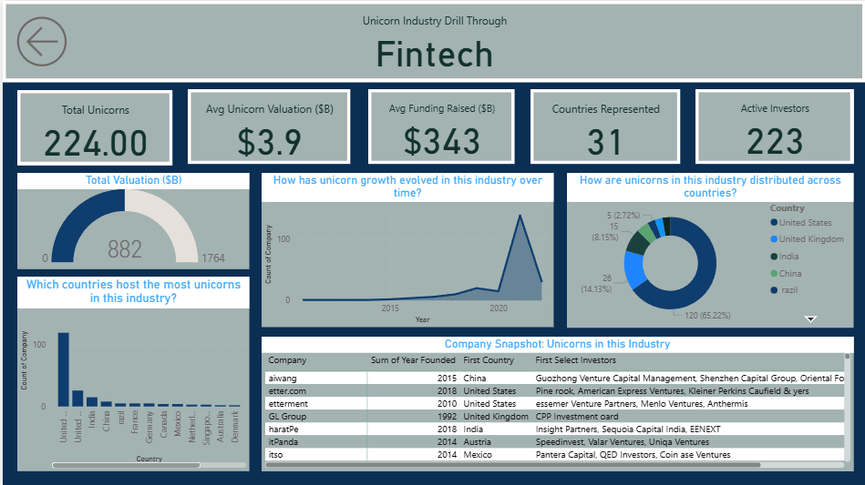

# Global Unicorn Ecosystem Power BI Dashboard

## Project Overview
This project analyzes the **global unicorn startup ecosystem** using Power BI.  
The dashboard explores funding trends, industry distribution, valuation patterns, and geographic spread of unicorn companies.

---

## Dashboard Preview

---

## Key Insights
- Total Unicorn Companies: **1.07K**
- Average Unicorn Valuation: **$3.5B**
- Average Funding Raised: **$333M**
- Countries Represented: **46**
- Active Unicorn Industries: **15**

---

## Features of the Dashboard
• KPI Cards for Unicorn ecosystem overview  
• Industry-wise valuation analysis  
• Funding vs valuation relationship  
• Global unicorn distribution map  
• Industry drill-through analysis

---

## Tools Used
- Power BI
- Data Visualization
- Business Intelligence
- Data Analysis

---

## Dataset
Dataset includes unicorn companies with information on:

- Company
- Country
- Industry
- Valuation
- Funding
- Investors

---

## Author
**Ashnoor Kaur**  
Aspiring Data Analyst  
SQL | Excel | Power BI | Data Analytics
